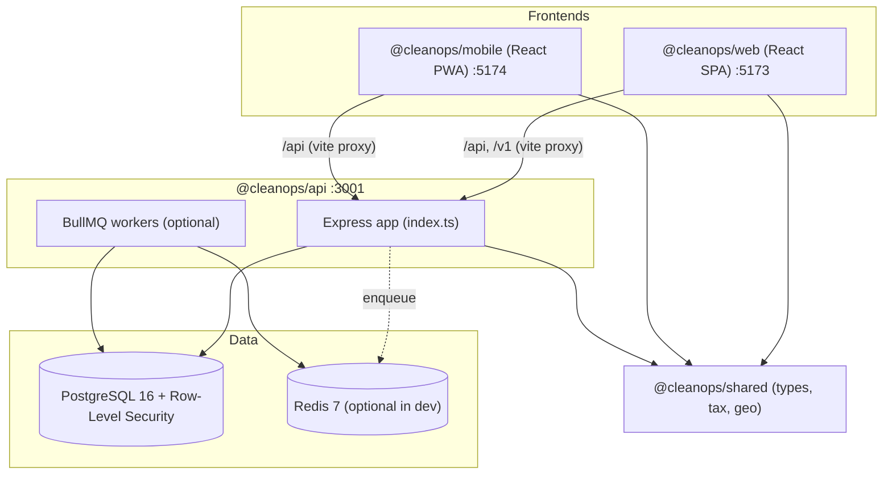
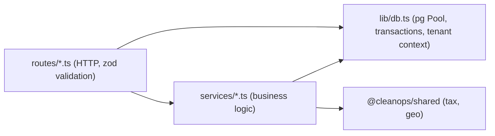
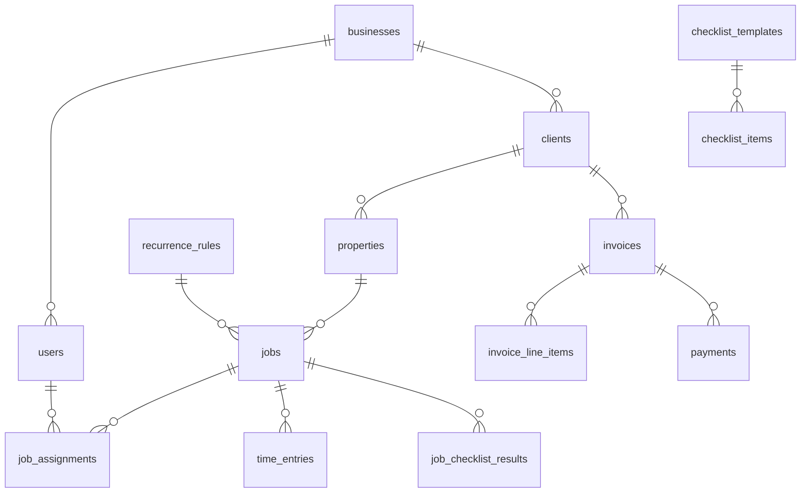

# CleanOps — System Architecture

This document describes how the CleanOps platform is put together so new developers
can navigate the codebase and contribute confidently. It reflects the code in this
repository (not an aspirational design). Where behaviour is stubbed or incomplete, it
is called out, and concrete follow-up work is listed in
[Outstanding work & roadmap](#outstanding-work--roadmap).

> New here? Start with [`README.md`](./README.md) and [`MVP.md`](./MVP.md) for how to
> run things, then use this document to understand *why* the pieces fit together.

---

## 1. Product overview

CleanOps is a multi-tenant cleaning-operations SaaS (ZenMaid-style), New Zealand first
with a Philippines rollout path. It covers booking + recurring job generation, cleaner
scheduling, checklists, GPS/time capture, GST-inclusive invoicing, payments, customer
messaging, a versioned public API, and cleaner "SOS" safety workflows.

There is **one product** delivered through **two frontends** (an office web dashboard
and a cleaner mobile PWA) backed by **one API** and **one Postgres database**.

---

## 2. High-level architecture



Key ideas:

- **Multi-tenancy** is enforced both in the app layer (a `business_id` on every tenant
  row, embedded in the JWT) and in the database via **Row-Level Security (RLS)** using a
  per-request session variable `app.current_business_id`.
- **Redis/BullMQ is optional in development.** `MVP_MODE=true` and `REDIS_OPTIONAL=true`
  mean the API runs without Redis and skips background enqueueing; recurring jobs can be
  generated on demand or come from the seed.
- The **public API** (`/v1`) is versioned and authenticated separately (API keys) from
  the internal app API (`/api`, JWT).

---

## 3. Monorepo layout

npm workspaces monorepo (package manager: **npm**, Node **22**).

```text
.
├── db/
│   ├── migrations/001_initial_schema.sql   # full schema + RLS policies
│   ├── migrations/002_recurrence_idempotency.sql
│   └── seed.sql                            # demo tenant "Harbour Shine"
├── packages/
│   ├── api/       # @cleanops/api    — Express 5, pg, BullMQ, zod, JWT
│   ├── shared/    # @cleanops/shared — types, constants, tax + geo helpers
│   ├── web/       # @cleanops/web    — React 19, react-router 7, Vite, Tailwind 3
│   └── mobile/    # @cleanops/mobile — React 19, Vite PWA, idb, Tailwind 4
├── scripts/mvp-setup.sh                    # DB bootstrap + writes packages/api/.env
├── docker-compose.yml                      # postgres, redis, api, worker
├── README.md / MVP.md / AGENTS.md
└── package.json                            # workspace scripts
```

Root scripts (`package.json`): `dev:api`, `dev:web`, `dev:mobile`, `worker`, `build`,
`test`. `build`/`test` fan out across workspaces with `--if-present`.

---

## 4. Backend API (`packages/api`)

### 4.1 App assembly

The Express app is created and wired in a single entrypoint — there is **no separate
`app.ts`**.

- `src/index.ts` — creates the app, applies global middleware, mounts all routers,
  registers `GET /health` and `GET /openapi.json`, and starts listening when
  `NODE_ENV !== 'test'` (the app is exported for tests). Handles graceful shutdown
  (`SIGTERM`/`SIGINT` → close server + `pool.end()`).

Global middleware order: `helmet()` → `cors()` (origins from `CORS_ORIGIN`) →
`express.json({ limit: '2mb' })` → `express.urlencoded()` → routers →
`notFoundHandler` → `errorHandler` (`src/lib/errors.ts`).

### 4.2 Layered structure



- **Routes** (`src/routes/`) parse/validate input (zod), enforce auth/roles, and shape
  responses. Shared helpers live in `routes/helpers.ts` (`getBusinessId`, `db(req)`,
  `ensureOwned`, `buildPatch`, pagination/id schemas).
- **Services** (`src/services/`) hold business logic that spans tables or is reused.
- **Data access** (`src/lib/db.ts`) wraps `pg.Pool` (`max: 20`) and exposes
  `query()`, `withTransaction()`, `withBusinessContext()`, and `setBusinessContext()`.

### 4.3 Middleware (`src/middleware`)

| Middleware | Applies to | Behaviour |
|---|---|---|
| `authenticateJwt` | most `/api/*` routes | Verifies Bearer JWT → sets `req.user`, `req.businessId` |
| `authenticateApiKey` | `/v1/*` | `X-Api-Key` header, bcrypt-compared to `api_keys.key_hash` |
| `tenancy` | tenant routes | Opens a DB connection, `BEGIN`, sets `app.current_business_id`, attaches `req.dbClient`, commits if `res.statusCode < 400` else rolls back |
| `requireRole(...roles)` | selected routes | Roles: `owner`, `office_admin`, `cleaner` |
| `publicApiRateLimit` | `/v1/*` only | In-memory `rate-limiter-flexible`, keyed by IP |

Auth primitives (`middleware/auth.ts`): `signAccessToken()` uses `jsonwebtoken`
(payload `businessId`, `role`, `email`; `sub` = user id). Passwords hashed with
`bcryptjs` (`BCRYPT_ROUNDS`, default 12). **Note:** the internal `/api/*` surface has
no rate limiter; only `/v1` is throttled.

### 4.4 Routes

Internal app API is mounted under `/api/*`; the public API under `/v1`.

| Router | Mount | Notable endpoints |
|---|---|---|
| `auth.ts` | `/api/auth` | `POST /register`, `POST /login`, `GET /me` (JWT) |
| `clients.ts` | `/api/clients` | CRUD; delete is soft (`active=false`) |
| `properties.ts` | `/api/properties` | CRUD + `GET /:id/access-notes` (audited) |
| `jobs.ts` | `/api/jobs` | `GET /`, `GET /calendar`, `POST /find-gaps`, `POST /`, `PATCH /:id`, `POST /:id/assignments` |
| `recurrence.ts` | `/api/recurrence` | CRUD; enqueues generation on create/update |
| `timeEntries.ts` | `/api/time-entries` | `POST /clock-in`, `POST /clock-out` |
| `checklists.ts` | `/api/checklists` | templates + items + `POST /results` |
| `invoices.ts` | `/api/invoices` | `GET`, `POST` (from jobs), `POST /:id/pdf`, `PATCH /:id/sent`, `PATCH /:id/void` |
| `payments.ts` | `/api/payments` | `POST /record`, `POST /manual-bank/confirm`, provider `POST /webhooks/*` (no auth), `GET /:id` |
| `messages.ts` | `/api/messages` | `POST /` (templated send) |
| `sos.ts` | `/api/sos` | `POST /trigger`, `GET /`, `PATCH /:id/resolve` |
| `availability.ts` | `/api/availability` | availability CRUD + time-off request/approve/reject |
| `earnings.ts` | `/api/earnings` | `GET /?start=&end=&user_id=` |
| `tax.ts` | `/api/tax` | `GET /jurisdictions`, `PATCH /pricing-mode` |
| `publicApi.ts` | `/v1` | clients/properties/jobs read + write (API-key auth) |

### 4.5 Services

| Service | Responsibility | Status |
|---|---|---|
| `tax.ts` | Load jurisdictions, compute GST via shared helpers | Working |
| `invoicing.ts` | Allocate invoice numbers, build lines from completed jobs, GST split | Working |
| `recurrence.ts` | Generate occurrence dates and jobs to a horizon; idempotent | Working |
| `payments.ts` | Normalize Stripe/Windcave/PayMongo webhooks, upsert payment, mark invoice paid when covered | Adapters present; **webhook verification stubbed, no provider SDKs** |
| `comms.ts` | Render templates, send SMS/email, log to `message_log` | **Stubbed sends; INSERT column bug (see roadmap)** |
| `pdf.ts` | Render invoice HTML / PDF | HTML works; **PDF is placeholder bytes** |
| `time.ts` | Date helpers + local haversine | Working (duplicates some shared logic) |

### 4.6 Configuration (`src/lib/config.ts`)

Env is validated with **zod at startup**; invalid config throws immediately.

- **Required:** `DATABASE_URL`, `JWT_SECRET` (≥ 16 chars).
- **Defaults:** `PORT=3001`, `JWT_EXPIRES_IN=7d`, `BCRYPT_ROUNDS=12`, `CORS_ORIGIN=*`,
  rate-limit knobs, `RECURRENCE_HORIZON_WEEKS=10`.
- **Feature flags:** `MVP_MODE` and `REDIS_OPTIONAL` default to `true` in development.
- **Provider secrets:** only the webhook secrets (`STRIPE_WEBHOOK_SECRET`,
  `WINDCAVE_WEBHOOK_SECRET`, `PAYMONGO_WEBHOOK_SECRET`) and a few `TWILIO_*`/
  `POSTMARK_*` keys are read into config; most keys in `.env.example` are placeholders.

### 4.7 Background workers (`src/workers`) — optional

Run with `npm run worker` (`tsx src/workers/index.ts`). Requires Redis.

| Queue | Trigger | Behaviour |
|---|---|---|
| `recurrence-generate` | API enqueue + nightly cron `0 2 * * *` (`nightly-horizon-fill`) | Generates due recurring jobs |
| `reminder-send` | (enqueue) | **Stub** returns `{ sent: true }` |
| `webhook-retry` | (enqueue) | **Stub** returns `{ retried: true }` |

In `MVP_MODE`, the API skips enqueueing, so the worker is not needed for the demo.

### 4.8 OpenAPI (`src/openapi.ts`)

Served at `GET /openapi.json` (OpenAPI 3.0.3, servers `/api` and `/v1`, security schemes
`bearerAuth` + `apiKeyAuth`). Currently an **endpoint inventory with summaries only** —
it does not yet document request/response schemas.

---

## 5. Multi-tenancy & Row-Level Security

```mermaid
sequenceDiagram
  participant C as Client (web/mobile)
  participant E as Express route
  participant M as tenancy middleware
  participant P as Postgres (RLS)

  C->>E: Request + Bearer JWT (businessId)
  E->>M: authenticateJwt sets req.businessId
  M->>P: BEGIN; set_config('app.current_business_id', businessId, true)
  E->>P: queries via req.dbClient
  P-->>E: only rows where business_id = current_setting(...)
  M->>P: COMMIT (if status < 400) / ROLLBACK
  E-->>C: Response
```

- Every tenant table has `business_id` and RLS enabled with a
  `{table}_business_context` policy comparing `business_id` to
  `NULLIF(current_setting('app.current_business_id', true), '')::uuid`.
- `tax_jurisdictions` is a **global reference table** (not RLS-protected). Auth/login and
  global tax reads intentionally run outside tenant context.
- **Idempotency** (for offline sync + webhooks) via unique indexes: jobs by
  `(business_id, recurrence_rule_id, scheduled_start)` and `(business_id, client_generated_id)`;
  `time_entries` and `job_checklist_results` by `(business_id, client_generated_id)`;
  `payments` by `(provider, provider_payment_id)`.

---

## 6. Shared package (`packages/shared`)

Barrel export in `src/index.ts`. Consumed by the API for tax math and by all packages
for type parity (the frontends also keep local `lib/types.ts` copies).

- `constants.ts` — `API_VERSION`, `RECURRENCE_HORIZON_WEEKS`, and enums (`ROLES`,
  `JOB_STATUSES`, `PAYMENT_PROVIDERS`, `INVOICE_STATUSES`, `PRICING_MODES`, …).
- `types.ts` — DB entity mirrors (`Business`, `User`, `Client`, `Property`, `Job`,
  `Invoice`, `Payment`, `RecurrenceRule`, `TimeEntry`, `SosAlert`, …).
- `tax.ts` — `splitGstInclusive()`, `addGstExclusive()` with bigint half-up rounding;
  `calculateLineTax()` convenience wrapper.
- `haversine.ts` — `haversineKm()` for GPS distance checks.

---

## 7. Web app (`packages/web`) — office dashboard

- **Stack:** React 19, react-router-dom 7, Vite 8, Tailwind 3.
- **Routing** (`App.tsx`): public `/login`, `/register`; protected `/`, `/clients`,
  `/clients/:id`, `/schedule`, `/jobs/:id`, `/invoices`, `/invoices/:id`, `/team`,
  `/sos`, `/settings`. Protected routes render inside `AppShell` (sidebar + `<Outlet/>`).
- **Auth** (`context/AuthContext.tsx`): on boot, if a token exists it calls
  `GET /auth/me`; `login`/`register` store the JWT.
- **API client** (`lib/api.ts`): prefixes `/api`, attaches
  `localStorage['cleanops.jwt']`, clears token on 401, throws `ApiError`.
- **Data fetching** (`lib/hooks.ts`): `useAsyncData(loader, deps)` →
  `{ data, loading, error, reload, setData }`.
- **Design system** (`components/Ui.tsx`, `StatusBadge.tsx`, `DataTable.tsx`, `Modal.tsx`).
  Brand color is the `coastal` palette in `tailwind.config.js` (currently a clean blue).
- **Vite** (`vite.config.ts`): port 5173; proxies `/api` and `/v1` → `http://localhost:3001`.

---

## 8. Mobile PWA (`packages/mobile`) — cleaner app

- **Stack:** React 19, Vite 8 + `vite-plugin-pwa`, `idb`, Tailwind 4.
- **Routing** (`App.tsx`, no router lib): `/login`, `/` (today/tomorrow), `/jobs/:id`
  (clock in/out, access notes, checklist), `/earnings`, `/availability`; bottom nav +
  floating SOS button.
- **Offline-first** (`lib/offline.ts`): IndexedDB `cleanops-mobile` with stores `jobs`
  (cached schedule), `pending` (mutation queue keyed by `client_generated_id`), `meta`.
  - `postOrQueue()` — when offline/failed, queues the mutation; server idempotency keys
    make replay safe.
  - `syncQueue(token)` / `installQueueSync()` — replay pending on `online` +
    `visibilitychange`; stop on 401.
- **Service worker** (`vite.config.ts`): `autoUpdate`; Workbox `NetworkFirst` for
  `/api/jobs*` (4s timeout, 24h max age); app shell precached. Registered in `main.tsx`.
- **API client** (`lib/api.ts`): prefixes `/api` (Vite proxy on 5174), stores full
  session in `localStorage['cleanops_mobile_session']`. Access notes are fetched
  online-only and audited; SOS has a native `sms:` fallback via `VITE_OFFICE_SMS`.

---

## 9. Database (`db/`)

Schema and RLS live in `db/migrations/001_initial_schema.sql`; `002_recurrence_idempotency.sql`
reasserts idempotency indexes. `db/seed.sql` provisions the demo tenant.



Table groups:

- **Tenancy:** `businesses`, `users` (email unique globally, `role`, pay fields).
- **CRM & sites:** `clients`, `properties` (lat/lng, `access_notes`), `property_access_log`.
- **Scheduling:** `recurrence_rules`, `jobs`, `job_assignments`, `cleaner_availability`,
  `cleaner_time_off`.
- **Field ops:** `checklist_templates`, `checklist_items`, `job_checklist_results`,
  `time_entries` (GPS + idempotency key).
- **Billing:** `invoices`, `invoice_line_items`, `payments` (providers: stripe, windcave,
  paymongo, manual_bank, poli).
- **Comms & safety:** `message_templates`, `message_log`, `sos_alerts`.
- **Integrations:** `api_keys`, `webhook_endpoints`, `webhook_deliveries`.
- **Reference:** `tax_jurisdictions` (NZ GST 1500 bps active, PH VAT 1200 bps inactive).

**Seed** (`Harbour Shine Cleaning`): owner `admin@harbourshine.nz` / `password123`,
cleaner `mia@harbourshine.nz` / `password123`, two clients + properties, a standard
checklist, a weekly recurrence, and 3 demo jobs.

---

## 10. Local development & environments

| Service | Port | Dev command | Notes |
|---|---|---|---|
| API | 3001 | `npm run dev:api` | `tsx watch`; `/health`, `/openapi.json` |
| Web | 5173 | `npm run dev:web` | proxies `/api`,`/v1` → 3001 |
| Mobile | 5174 | `npm run dev:mobile` | proxies `/api` → 3001 |
| Worker | — | `npm run worker` | optional; needs Redis |
| Postgres | 5432 | Docker or local | `cleanops`/`cleanops` |
| Redis | 6379 | Docker or local | optional in dev |

Bootstrap once per environment: `./scripts/mvp-setup.sh` (creates role/db, applies
migrations + seed, writes `packages/api/.env`). Docker path:
`cp .env.example .env && docker compose up --build` (web/mobile are commented out and
run via npm). See [`AGENTS.md`](./AGENTS.md) for cloud/dev-environment caveats
(e.g. Tailwind config changes require a web dev-server restart).

**Build/test/lint:** `npm run build` (tsc across workspaces + vite build for
web/mobile), `npm test` (Vitest; currently only `packages/api` has tests:
`test/tax.test.ts`, `test/recurrence.test.ts`). **No linter is configured.**

---

## 11. External integrations

| Provider | Where | Live? |
|---|---|---|
| Stripe | `services/payments.ts`, `POST /api/payments/webhooks/stripe` | Adapter + webhook route present; verification stubbed, no SDK |
| Windcave (NZ) | same pattern, `/webhooks/windcave` | Stubbed |
| PayMongo (PH) | same pattern, `/webhooks/paymongo` | Stubbed |
| Twilio (SMS) | env only; `comms.ts` uses stub sender | No |
| Postmark (email) | env only; `comms.ts` uses stub sender | No |
| Manual bank | `POST /api/payments/record`, `/manual-bank/confirm` | **MVP path — works without providers** |
| SOS SMS | mobile native `sms:` fallback; API `notifyOfficeAdmins` stub | Partial (client-side) |

---

## 12. MVP scope (`MVP.md`)

**In scope:** office+cleaner auth; clients/properties CRUD; schedule view/create/assign;
cleaner today's jobs, GPS clock in/out, audited access notes, checklist, SOS; invoices
from completed jobs (NZ GST inclusive) + mark sent; manual bank payment.

**Out of scope (MVP):** PH PayMongo/BIR UI; public API-keys UI; live
Twilio/Postmark/Stripe; nightly worker dependency; full offline-sync polish.

---

## 13. Outstanding work & roadmap

Items below are grouped by priority. The **Known bugs** were verified against the
current source and each links to the offending file.

### 13.1 Known bugs (verified)

- [ ] **Messaging INSERT targets a non-existent column.**
  `services/comms.ts` inserts into `message_log (… destination …)`, but the schema
  column is `to_address` (see `db/migrations/001_initial_schema.sql`), and `subject`
  is never set. Any `POST /api/messages` call will fail at the DB. Fix the column names
  (and optionally set `subject`) in `sendTemplatedMessage`.
- [ ] **Mobile time-off field names mismatch the API.**
  Mobile sends `start_at`/`end_at` (`packages/mobile/src/lib/api.ts`,
  `packages/mobile/src/App.tsx`), but `POST /api/availability/time-off` validates
  `starts_at`/`ends_at` (`packages/api/src/routes/availability.ts`). Time-off requests
  from the app are rejected. Align the field names (prefer the API's `starts_at`/`ends_at`).
- [ ] **Invoice "Mark paid" is a UI stub.**
  `packages/web/src/pages/InvoiceDetailPage.tsx` shows a placeholder message instead of
  recording a payment. Wire it to `POST /api/payments/record` (which exists) or add a
  dedicated mark-paid endpoint, then refresh invoice status.

### 13.2 Complete the MVP

- [ ] Manual bank payment UI end-to-end in the web app (create + confirm), replacing the
  stub above.
- [ ] Confirm the cleaner mobile happy path e2e (clock-in → checklist → clock-out
  auto-completes job) against the API, including offline queue replay.
- [ ] Real invoice PDF generation in `services/pdf.ts` (Puppeteer is a dependency but
  the current output is placeholder bytes); decide on `PUPPETEER_SKIP_DOWNLOAD` handling.

### 13.3 Integrations & background processing

- [ ] Implement real webhook signature verification and provider SDK calls in
  `services/payments.ts` (Stripe first, then Windcave, then PayMongo).
- [ ] Implement live SMS/email in `services/comms.ts` (Twilio + Postmark) behind the
  existing template/log abstraction; load the provider keys into `config.ts`.
- [ ] Flesh out the `reminder-send` and `webhook-retry` workers (currently stubs) and
  validate the nightly recurrence horizon-fill cron with Redis enabled.

### 13.4 Public API & docs

- [ ] Build the API-keys management UI and expand `/v1` coverage as needed.
- [ ] Expand `src/openapi.ts` from an endpoint inventory into a full contract
  (request/response schemas), and consider generating client types from it.

### 13.5 Quality, security & hardening

- [ ] Add a linter/formatter (e.g. ESLint + Prettier) across workspaces — none exists today.
- [ ] Grow automated test coverage beyond `tax`/`recurrence` (routes, tenancy/RLS,
  invoicing, payments, offline sync).
- [ ] Add rate limiting / abuse protection to sensitive `/api/*` routes (only `/v1` is
  throttled today) and review CORS defaults for production.
- [ ] Reconcile duplicated logic (e.g. haversine in both `@cleanops/shared` and
  `services/time.ts`; frontend `lib/types.ts` vs `@cleanops/shared`).
- [ ] Philippines rollout: PayMongo enablement, PH VAT jurisdiction activation, and
  BIR/ATP invoice fields UI.

> Tip: when picking up a roadmap item, follow the layering in
> [§4.2](#42-layered-structure) — validate in the route, put reusable logic in a service,
> and access the DB through `lib/db.ts` so tenant context/RLS stays intact.
